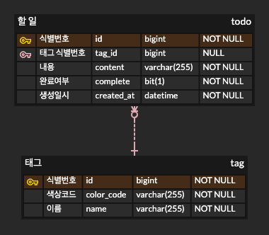
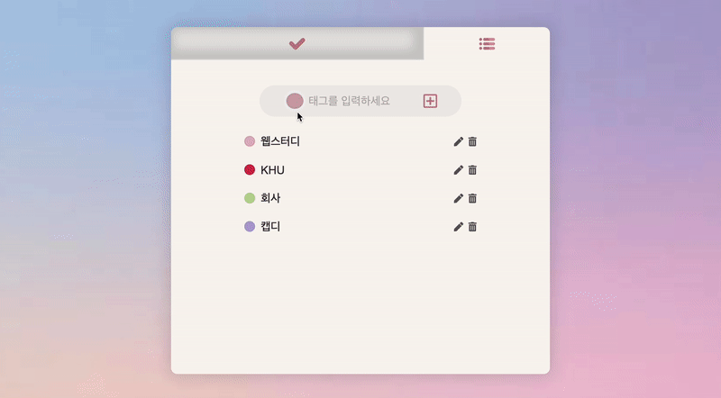
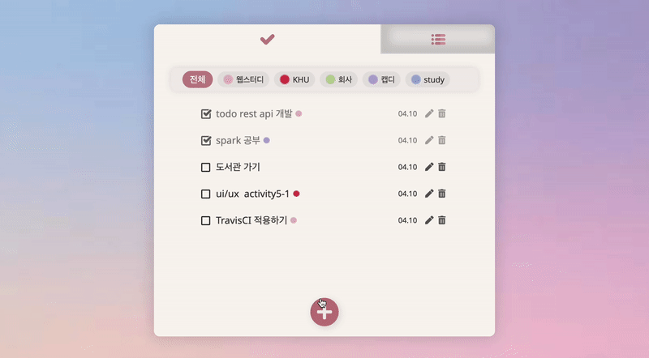
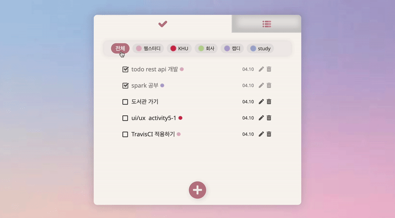

# Return Todo
KHU Return Web Study Project 1

## 기술스택

## ERD

    

## 주소

### return todo

http://return-todo.seohyuni.com/

### swagger

http://return-todo-server.seohyuni.com/swagger-ui.html

## 주요기능

### 🏷️ Tag
: 원하는 색상과 함께 태그를 생성합니다.

    

### ✔️ Todo
: 태그와 함께 할 일을 생성하고 관리합니다.

    

### 🔍 Search
: 완료여부에 따라, 지정된 태그에 따라 검색할 수 있습니다.

    

